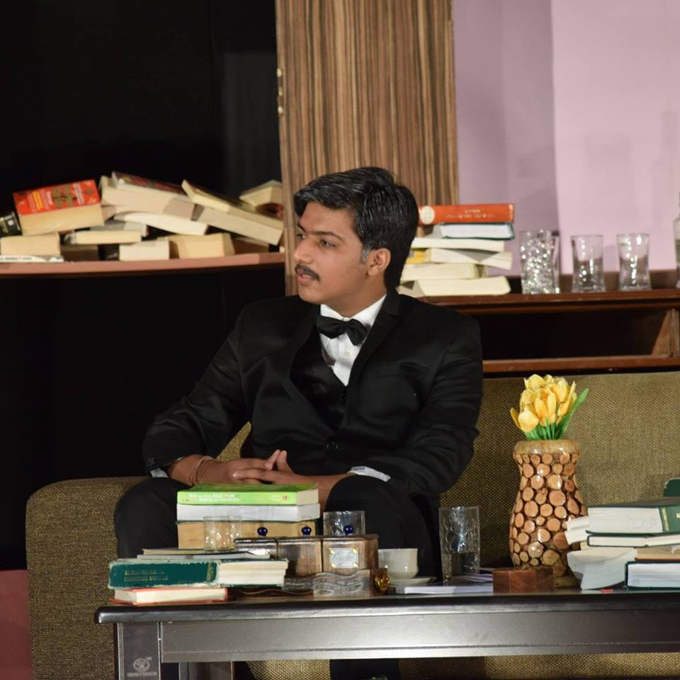

  

I am a Computer Science sophomore at Indian Institute of Technology, Roorkee.

 I was born and raised up in Guna, a small town in Madhya Pradesh. I did my primary schooling from Vandana Convent Senior Secondary School and then went to Delhi Public School, Vijaipur for my post primary studies.

Currently I am enrolled as a CSE undergrad at IIT Roorkee. I obtained an AIR 453 in JEE Advanced 2016. Besides this, I am also a KVPY as well as an NTSE scholar.

My areas of interest include Android Development and Information Security. My programming journey began with the learning of Java. From then on I have learnt Java, C, C++, python, HTML5, CSS3 etc and the learning phase still continues.

Currently I am working as an Android Developer at <a href = "https://mdg.sdslabs.co/"><strong>Mobile Development Group, IITR</strong></a> and as a Dramatist at Dramatics Section IIT Roorkee.

